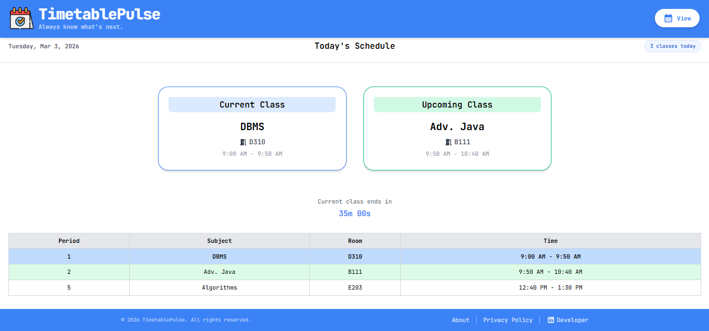
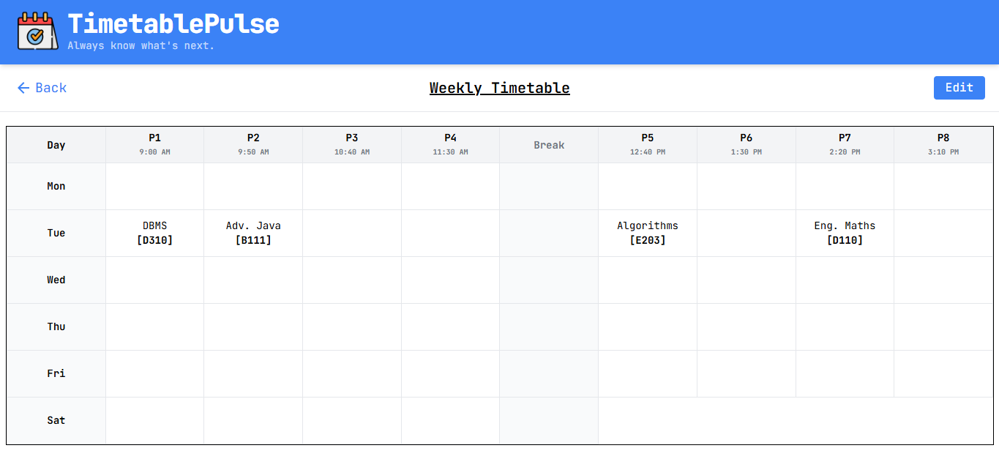
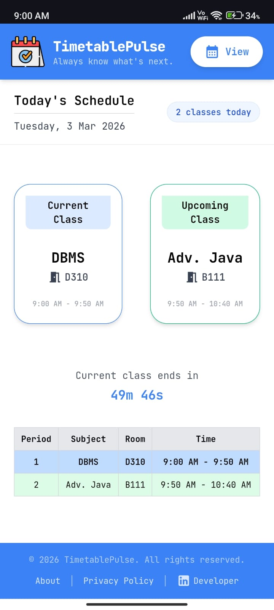
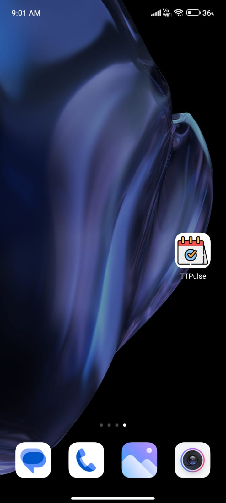

# TimetablePulse

TimetablePulse is a real-time class schedule tracker. It shows your current and upcoming class at a glance, displays all classes for the day, and includes a live countdown so you always know what's next. Currently designed for university students and faculty, the app supports **Integral University, Lucknow**, following its timetable structure. In the future, users will be able to configure their own schedules, making it adaptable to any university.

---

## Screenshots

**Desktop - Home Page**  
  

**Desktop - Timetable Page**  
  

**Mobile - Home Page**  
  

**Mobile - PWA Home Screen**  
  

---

## Features

- View **current and upcoming classes** in real-time
- Live countdown timer for current or next class
- Displays **all classes for today**
- Add, edit, or clear your weekly timetable
- Mobile-friendly UI
- Persistent storage using **localStorage** (no account required)
- Privacy-focused: no personal data is collected

---

## Technologies Used

- **React.js** - UI framework
- **Tailwind CSS** - Styling
- **Firebase Analytics** - Anonymous usage tracking
- **React Router** - Routing
- **Material UI Icons** - Icons
- **localStorage** - Persistent timetable data

---

## Installation

1. Clone the repository:
   ```bash
   git clone https://github.com/yourusername/timetable-pulse.git
   cd timetable-pulse
   ```

2. Install dependencies:
   ```bash
   npm install
   ```

3. Create a `.env` file based on `.env.example` and add your Firebase credentials.

4. Start the development server:
   ```bash
   npm start
   ```

5. Open the app at `http://localhost:3000`

---

## Usage

1. Open the app and click **Add Timetable** if no timetable exists
2. Enter subjects and room numbers for each period
3. View **current class**, **upcoming class**, and **today's schedule** on the home page
4. Use the **Edit**, **Save**, or **Clear** buttons on the Timetable page to update your schedule

---
## Test Cases

| Feature | Test Case | Expected Result |
|---|---|---|
| No Timetable Added | Open app without adding any timetable | Shows "No timetable data available. Please add your weekly timetable to get started." with Add Timetable button |
| Add Timetable | Enter subjects and rooms, then save | Timetable saved and displayed on Home page |
| Edit Timetable | Click Edit, change subjects/rooms, save | Changes reflected in timetable |
| Clear Timetable | Click Clear button on Timetable page | Shows confirmation prompt "This will clear the entire timetable. Continue?" - on OK, clears only after clicking Save |
| Clear Button Disabled | Open Timetable page when timetable is already empty | Clear button is disabled, cannot be clicked |
| No Classes Today | Open app on a day with no subjects entered for that day | Shows "0 classes today", Current Class and Upcoming Class both show "-", and "No classes scheduled for today." message |
| One Class, Not Started Yet | Current time is before the only class of the day | Upcoming Class shows subject, room, time, and countdown "Next class starts in Xm Xs" |
| Current Class Active | Current time is within a class period | Current Class card shows subject, room, time, and countdown "Current class ends in Xm Xs" |
| Current + Upcoming Class | Current time is within first class, second class exists | Current Class and Upcoming Class both shown with subject, room, and time |
| All Classes Completed | Current time is after the last period of the day | Shows "All classes completed" with View Timetable toggle button |
| View/Hide Timetable Toggle | Click "View Timetable" on All Classes Completed screen | Expands to show today's timetable; button changes to "Hide Timetable" |
| Sunday | Open app on Sunday | Shows "No classes today" |
| localStorage Persistence | Reload page after adding timetable | Timetable data persists without re-entering |
| Privacy | Inspect app storage | No personal data stored; only timetable data in localStorage |
|---|---|---|
| No Timetable Added | Open app without adding any timetable | Shows "No timetable data available. Please add your weekly timetable to get started." with Add Timetable button |
| Add Timetable | Enter subjects and rooms, then save | Timetable saved and displayed on Home page |
| Edit Timetable | Click Edit, change subjects/rooms, save | Changes reflected in timetable |
| Clear Timetable | Click Clear button | Timetable emptied, app returns to "No timetable data available" state |
| Current Class | Set system time within a class period | Current class card highlighted, countdown shown |
| Upcoming Class | Set system time before next class | Upcoming class card shown with countdown |
| No Classes Scheduled Today | Open app on a day with no subjects entered | Shows "No classes scheduled for today" |
| All Classes Completed | Set system time after last period of the day | Shows "All classes completed for today" |
| Sunday | Set system day to Sunday | Shows "No classes today - Enjoy your day off!" |
| localStorage Persistence | Reload page after adding timetable | Timetable data persists without re-entering |
| Privacy | Inspect app storage | No personal data stored; only timetable data in localStorage |

## Folder Structure

```
TIMETABLE-PULSE/
|
+-- public/                 # Static assets (index.html, favicon, manifest)
+-- src/
|   +-- assets/             # Images, fonts, etc.
|   +-- Components/         # Reusable UI components (Header, Footer, ClassCard)
|   +-- constants/          # Config constants like timetable periods
|   +-- pages/              # Page-level components (Home, About, Privacy, Timetable)
|   +-- App.js              # Root component
|   +-- index.js            # Entry point
|   +-- firebase.js         # Firebase config
+-- .env                    # Firebase environment variables
+-- package.json            # Project metadata & dependencies
+-- README.md               # Project documentation
+-- tailwind.config.js      # Tailwind CSS config
```

---

## Future Plans

- Allow users to **configure their own schedule**, making the app adaptable to any university
- Add **export/import timetable** functionality
- Enhance **analytics for usage insights** while preserving anonymity

---

## Developer

**Abdullah Ansari** - [LinkedIn](https://www.linkedin.com/in/abdullahlko)

---

